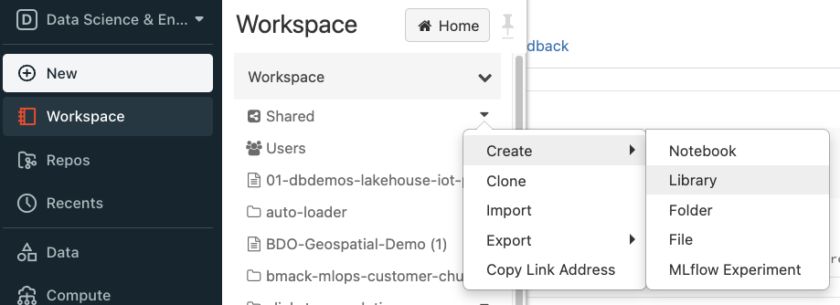
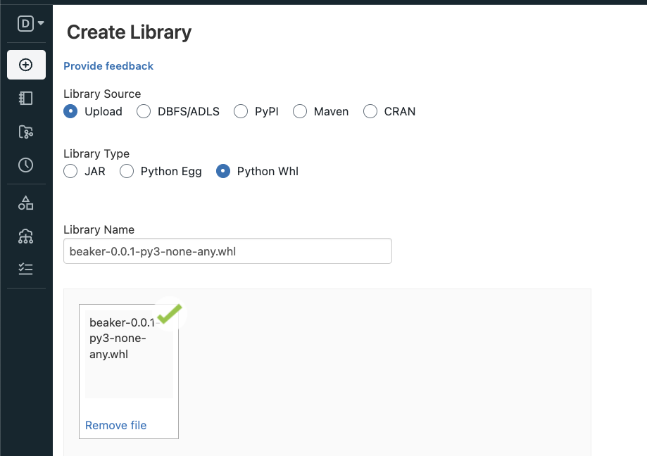
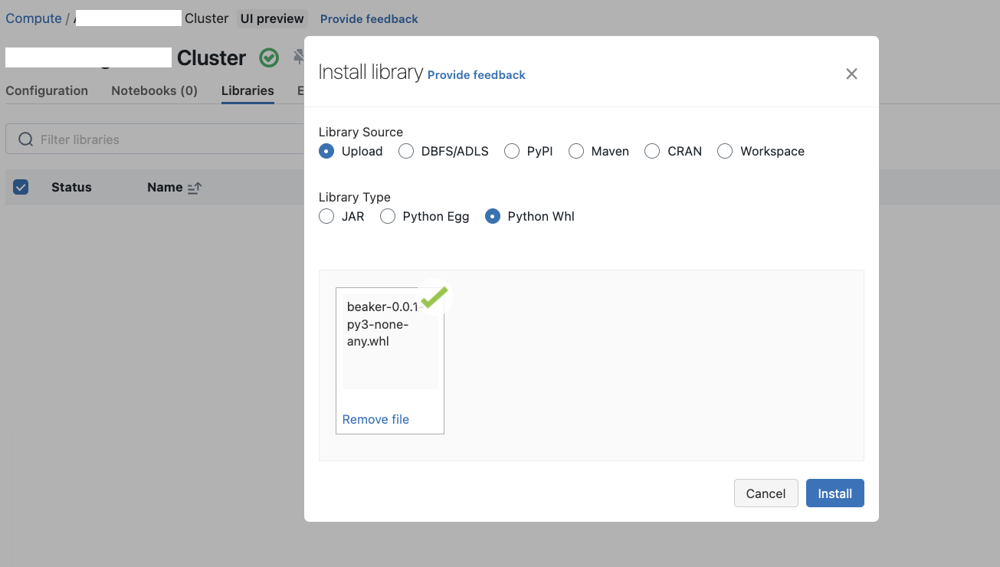
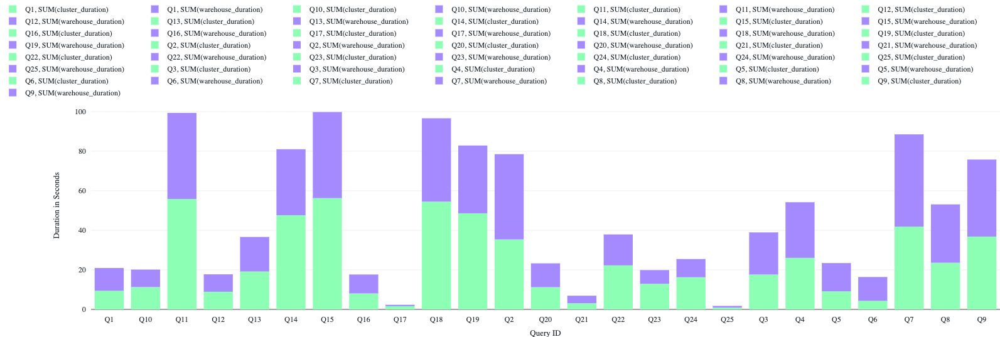

# Beaker 🧪
Beaker is a Python library that makes executing query benchmarks against Databricks SQL warehouses and clusters simple.


## Examples

There are three examples:

#### examples/beaker_standalone.py
Standalone. Run from example directory as `> python beaker_standalone.py`.

#### examples/getting_started.ipynb
Run in any jupyter notebook environment.

#### examples/beaker_getting_started.py
Databricks notebook source.


## Getting Started

### Installation

Currently the package is not published to PyPi, so you will need to install the custom Python whl file as workspace library, cluster library or notebook-scope library
1. Download the python wheel file from the latest [release](https://github.com/goodwillpunning/beaker/releases)
2. Option 1: Install as workspace library -> Go to Shared/Create/Library
    
    
3. Option 2: Install as cluster library
    Go to Libraries under your Cluster config.  
    a. You can choose the uploaded workspace library in above step, and install it on the cluster. Choose `Workspace` as `Library Source`
    
    b. Or you can upload the wheel file directly to cluster library
    
    
4. Option 3: Install as notebook-scoped library
   - Upload the wheelfile to `dbfs:/FileStore` then run `%pip install` in your notebook Python cell
   - `pip install path/to/your/whl_file`

### Usage

You can create a new Benchmark test by passing in the parameters to the constructor or set the parameters later.

```python
from beaker.benchmark import *

# First, create a new Benchmark object, specifying connection parameters
benchmark = Benchmark(query=query, hostname=hostname, http_path=http_path, token=token)
```

The Benchmark class can also use a builder pattern to specify the connection parameters.
```python
benchmark = Benchmark()
benchmark.setHostname(hostname=hostname)
# HTTP path to an existing warehouse/cluster
benchmark.setWarehouse(http_path=http_path)
benchmark.setConcurrency(concurrency=10)
benchmark.setWarehouseToken(token=token)
benchmark.setQuery(query=query)
benchmark.setCatalog(catalog="hive_metastore")
benchmark.preWarmTables(tables=["table_1", "table_2", "table_3"])
```

You may even choose to provision a new SQL warehouse. 
You can choose the warehouse type (pro, classic, serverless) by specify the warehouse parameter. Default to serverless if "warehouse" param is not specified

```python
new_warehouse_config = {
    "type": "warehouse",
    "warehouse": "serverless", # -> specify the warehouse type (pro, classic, serverless). Default to serverless
    "runtime": "latest",
    "size": "Large",
    "min_num_clusters": 1,
    "max_num_clusters": 3,
    "enable_photon": True
}
benchmark.setWarehouseConfig(new_warehouse_config)
```

Finally, calling the `.execute()` function runs the benchmark test.
```python
# Run the benchmark!
metrics = benchmark.execute()
print(metrics)
```

`metrics` is a pandas dataframe of the result of a single query execution.

If you want to examine the results as a spark DataFrame and your environment has the capability of creating a spark session, you can use spark_fixture.

```
import spark_fixture

df = spark_fixture.metrics_to_df_view(metrics, view_name='beaker_benchmark_test')
df.display()
```

The above will also create a view with the name `beaker_benchmark_test` so you can use SQL to analyze the results.

```
%sql
select * from beaker_benchmark_tests;
```


## Authentication
`beaker` connects to the SQL warehouse or cluster using the Databricks REST API 2.0. As a result, connection information is needed.

It's recommended that you do not hard-code authentication secrets. Instead consider using environment variables.

Example usage:

```shell
export DATABRICKS_HOST=<workspace-hostname>.databricks.com
export DATABRICKS_HTTP_PATH=/sql/1.0/warehouses/<warehouse-id>
export DATABRICKS_TOKEN=dapi01234567890
```

```python
import os
from beaker import Benchmark

hostname = os.getenv("DATABRICKS_HOST")
http_path = os.getenv("DATABRICKS_HTTP_PATH")
token = os.getenv("DATABRICKS_ACCESS_TOKEN")

benchmark = Benchmark(hostname=hostname, http_path=http_path, token=token)
```                
                
## Setting the benchmark queries to execute
Beaker can be given queries to execute in several ways:
1. Execute a single query
```benchmark.setQuery(query=query)```
2. Execute several queries from a file
```benchmark.setQueryFile(query_file=query_file)```
3. Execute several query files given a local directory
```benchmark.setQueryFileDir(query_file_dir=query_file_dir)```

However, if multiple of the above are provided, the following query format precedence will be followed:
1. **Query File Dir** - if a local directory is provided then Beaker will parse all query files under the directory
2. **Query File** - if no query directory is provided, but a query file is, then Beaker will parse the query file. See below for two different formats for a single file.
3. **Single Query** - if no query directory or query file is provided, then Beaker will execute a single query

## Execute Multiple Queries Concurrently
`Beaker` was created with concurrency in mind. For example, it's useful for answering questions like, "How will a SQL warehouse perform under peak, interactive usage?".

You can test concurrent query execution by listing the benchmark queries in a **file**.

Two query formats are supported.

#### Query file format: original
The query file must contain queries that are separated using the following format:

```sql
-- a unique query identifier (header) followed by a newline
Q1

-- the query body followed by a new line
SELECT * FROM us_population_2016 WHERE state in ('DE', 'MD', 'VA');

```

#### Query file format: semicolon-delimited
The query file must contain queries that are separated by a semicolon:

```sql
-- some comment
select * from foo;

-- more comments
SELECT * FROM us_population_2016 WHERE state in ('DE', 'MD', 'VA');
```

## Viewing the metrics report
The metrics report is best viewed as a single dataframe (using ```spark_fixture.metrics_to_df_view``` as shown above).
A temporary view is also created, to make querying the output and building local visualizations easier. 



## Contributing
Please help! Drop me a line at: will.girten@databricks.com if you're interested.

## Legal Information
This software is provided as-is and is not officially supported by Databricks through customer technical support channels. Support, questions, and feature requests can be submitted through the Issues page of this repo. Please see the [legal agreement](LICENSE) and understand that issues with the use of this code will not be answered or investigated by Databricks Support.
